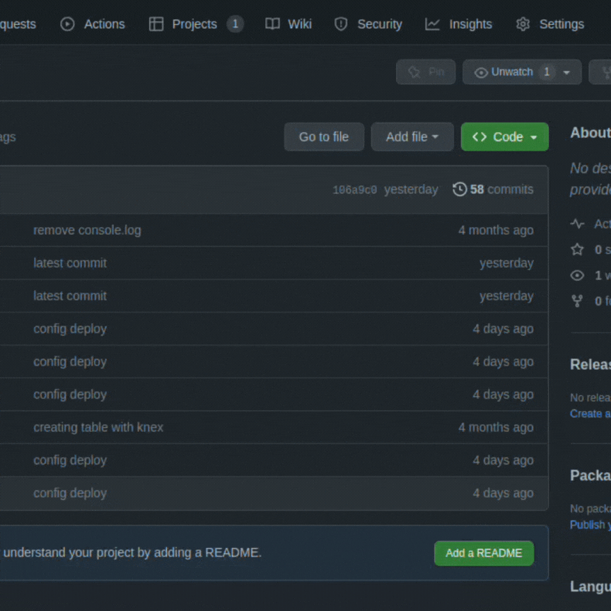
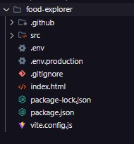
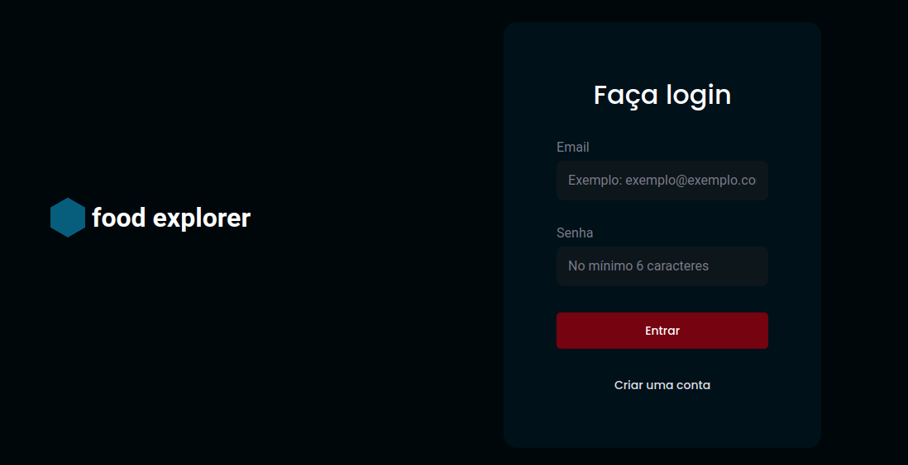

<h1 id="top">Food Explorer</h1>

<p>Essa aplicação foi criada para o desafio final do curso Explorer da Rocketseat</p>

<div class="menu" style="display:flex; gap:10px;">
  <label for="#doc"><a href="#doc">Documentação</a></label>
  <label for="#api"><a href="#api">Rodando API</a></label>
  <label for="#serverConect"><a href="#serverConect">Conectando com o Servidor</a></label>
  <label for="#viewApp"><a href="#viewApp">Visualizando a aplicação</a></label>
  <label for="#userAdm"><a href="#userAdm">Criando user Adm</a></label>
  
</div>

### 🛠 Tecnologias

As seguintes ferramentas foram usadas na construção do projeto:

- [Node.js](https://nodejs.org/en/)
- [React](https://pt-br.reactjs.org/)
- [StyledComponents](https://styled-components.com/)

## 💻 Projeto

[Veja o projeto aqui](https://foodexplorercomplet.netlify.app/)

Esse site é o resultado de 1 ano de muito estudo e dedicação! depois de quase 1 anos de curso da Rocketseat, realizei esse desafio final! Tive que desenvolver um site e-commerce de um restaurante, onde o usuário administrativo pode criar, editar e excluir qualquer prato, além de criar categorias para cada prato especifico , e o usuário comum pode, favoritar qualquer prato, buscar pelo nome da comida ou pelo ingrediente, e adicionar quantos itens desejar no carrinho!

<h2 id="doc">Documentação</h2>

<h3> - Necessário:</h3>
<p>Para conseguir rodar o projeto na sua máquina é necessário ter o <a href="https://git-scm.com/">GIT</a> e o <a href="https://nodejs.org/en">NODE.JS</a> instalado (verifique a versão de ambos e, se for preciso, atualize para a ultima versão)</p>

<h3> - clonado o repositório:</h3>

<p>Primeiro passo é clonar o código para sua máquina, podemos fazer isso utilizando o git clone, basta clicar no botão "code" e escolher a forma que deseja clonar, https ou <a href="https://docs.github.com/pt/authentication/connecting-to-github-with-ssh/generating-a-new-ssh-key-and-adding-it-to-the-ssh-agent">ssh</a></p>


<p>Com o link copiado, abra seu terminal na pasta que deseja colocar o projeto e execute git clone</p>

```
git clone https://github.com/gabriel-vitebo/food-explorer.git
```

<p>Depois de termina de clonar, no seu editor de código, vc já deve conseguir visualizar a pasta com os conteúdos dentro</p>


<h3> - Instalando as dependências:</h3>

<p>Agora, com o projeto já clonado, vamos instalar todas as dependências que o projeto precisa para rodar, primeiro, verifique se você está dentro da pasta do projeto,se executar o npm install fora da pasta, não irá funcionar, agora vamos utilizar o npm install</p>

```
npm install
```

<p>Depois de instalar todas as dependências, irá aparecer uma pasta chamada "node_modules"</p>

<b>IMPORTANTE</b>

<p>Para rodar o projeto na sua máquina é preciso ter a API rodando na sua máquina também, por isso, abaixo vou disponibilizar o passo a passo para rodar a API</p>

<h3 id="api"> - Rodando a API</h3>
Aqui vou dar os comandos necessários para rodar a API na sua maquina, caso queira ver a documentação da API com mais detalhes, pode acessar <a href="https://github.com/gabriel-vitebo/api-food-explorer" target=”_blank >API FOOD EXPLORER</a>

<p>crie outra pasta para a API, clone o repositório com https, ssh ou da maneira que preferir</p>

```
git clone https://github.com/gabriel-vitebo/api-food-explorer.git
```

instale as dependências do projeto

```
npm install
```

Crie as tabelas do banco de dados com o comando:

```
npm run migrate
```

E por fim, se conecte com a API utilizando

```
npm run dev
```

<p>se no seu terminal exibir a mensagem</p>

```
server is running on Port 3333
```

<p>Significa que a API está rodando na sua maquina, então, vamos seguir em frente com o front-end</p>

<b>IMPORTANTE</b>

<p>Em todo momento que estive utilizando a aplicação em localhost, essa API deve está rodando, caso contrario, não será possível fazer qualquer requisição</p>

<h3 id="serverConect"> - Conectando com o servidor</h3>
<p>Agora com o projeto clonado, as dependências instaladas, e a API rodando, vamos conectar com o servidor e visualizar a aplicação rodando o comando</p>

```
npm run dev
```

<p>Deverá mostrar um link como</p>

```
http://localhost:5174/
```

<p>O número da porta pode mudar, pode não ser necessariamente '5174'</p>

<h3 id="viewApp"> - Visualizando a aplicação</h3>

Quando a página abrir, essa é a página que você vai visualizar

<div>
  
</div>

<p>Clicando no botão de "criar uma conta" irá entrar na página de SignUp </p>

<b>IMPORTANTE</b>

<p>na página de SignUp só é possível criar usuário comuns, ou seja, que não tenham as permissões que um usuário administrativo tem</p>

<h3 id="userAdm"> - Criando usuário administrativo </h3>
<p>você pode criar um usuário administrativo de duas formas:</p>
<ol>
  <li>criando direto pelo BackEnd seguindo a documentação da API que deixei no começo</li>
  <li>Abrindo o terminal na pasta do projeto front-end,caso o projeto já esteja rodando, abra outro terminal na mesma pasta e execute o comando:</li>
</ol>

```
npm run userAdm
```

<p>Esse comando vai gerar um usuário administrativo automático para você, depois que roda o comando basta logar com o email e senha que irá mostrar no terminal</p>
<p>Caso queira mudar alguma  informação no usuário Adm, basta entrar na pasta src, depois na pasta utils, e entrar no arquivo "createUserAdm"</p>
<p>Caso for mudar alguma informação, cuidado para não alterar mais nada, mude apenas os valores de "name, email ou password", caso mude outra coisa, o script de criar um Usuario adm não irá funcionar </p>

```javascript
// Caso queira, Mude somente essas informações

name: "string",
email: "string@string.com",
password: "string",
```

<p>Depois de logado, fique livre para testar a aplicação do seu jeito</p>

## Licença

Esse projeto está sob a licença MIT.

### Autor

---

<a href="https://www.linkedin.com/in/gabriel-alves-vitebo-2978ab177/">
 
 <br />
 <sub><b>Gabriel Vitebo</b></sub></a> <a href="https://www.linkedin.com/in/gabriel-alves-vitebo-2978ab177/" >✅</a>

Feito com ❤️ por Gabriel Vitebo 👋🏽 Entre em contato!

<div > 
  <a href="https://www.instagram.com/gabrielvitebo/" target="_blank"></a>
  <a href="https://www.linkedin.com/in/gabriel-alves-vitebo-2978ab177/" target="_blank"></a>
  <a href="mailto:vitebo@outlook.com" ></a>
</div>
